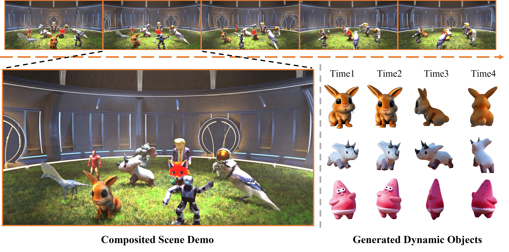

<h1 align=center font-weight:100> <strong><i>DreamMesh4D</i></strong>: Video-to-4D Generation with Sparse-Controlled Gaussian-Mesh Hybrid Representation</h1>

<h3 align="center">NeurIPS 2024</h3>

<h5 align="center">

[](https://arxiv.org/abs/2410.06756)
[](https://lizhiqi49.github.io/DreamMesh4D/)

</h5>


<p align="center">
  
</p>

This as an official implementation of our NeurIPS 2024 paper [DreamMesh4D: Video-to-4D Generation with Sparse-Controlled Gaussian-Mesh Hybrid Representation](https://arxiv.org/abs/2410.06756), based on the [threestudio](https://github.com/threestudio-project/threestudio) framework.


## 🔧Installation
DreamMesh4D is implemented based on [threestudio](https://github.com/threestudio-project/threestudio). We modify the code of threestudio base repository to support fp16 inference for Zero123, and the main part of our method is under `custom/threestudio-dreammesh4d`.

* Install `PyTorch >= 1.12`. We test our code on `torch2.2.1+cu118`, but other versions should also work fine.
```
# torch2.2.1+cu118
pip install torch==2.2.1 torchvision==0.17.1 torchaudio==2.2.1 --index-url https://download.pytorch.org/whl/cu118
```
* (Optional, Recommended) Install ninja to speed up the compilation of CUDA extensions:
```
pip install ninja
```
* Install dependencies:
```
# install 3D Gaussian modules
git clone --recursive https://github.com/ashawkey/diff-gaussian-rasterization
git clone https://github.com/DSaurus/simple-knn.git
# install
pip install -r requirements.txt
```


## 🚀Quick Start

### 1. Prepare the data
We follow the same data structure as [Consistent4D](https://github.com/yanqinJiang/Consistent4D). You can download the test dataset [here](https://drive.google.com/file/d/1jn18kA2FfKMnyQ6fisIn8rhBI0dr3NFk/view).

If you'd like to use your own data, please preprocess it as follows:

1. Split the video into individual frames and name each frame using the format `{id}.png`.
2. Segment the foreground object in each frame. (We use [rembg](https://github.com/danielgatis/rembg) for background removal.)

Your input data should follow this structure:
```
-image_seq_name
    - 0.png
    - 1.png
    - 2.png
    ...
```

### 2. Training

#### 2.1 Static stage
For static 3D model generation and mesh export, we use Stable Zero123 in sds manner. You can follow the instructions provided in [threestudio](https://github.com/threestudio-project/threestudio) to generate 3D objects and export the coarse mesh. The example command:
```
# 3d model generation with stable zero123
python launch.py --config configs/stable-zero123.yaml --train data.image_path=path/to/ref/img

# mesh export
python launch.py --config path/to/trial/dir/configs/parsed.yaml --export resume=path/to/trial/dir/ckpts/last.ckpt system.exporter_type=mesh-exporter system.exporter.fmt=obj system.geometry.isosurface_method=mc-cpu system.geometry.isosurface_resolution=256
```
**Note**: 
* The argument `system.exporter.fmt=obj` is required, as we need vertex colors for initializing the colors of the Gaussians.
* Since marching-cubes always produces very dense faces, we suggest simplifying the exported mesh with following command to avoid too large computation overhead and "CUDA-out-of-memory" problem:
    ```
    python custom/threestudio-dreammesh4d/scripts/mesh_simplification.py --mesh_path path/to/export/mesh --scale simplify_scale --output path/to/output/dir
    ```

After getting coarse mesh, we attach the Gaussians and refine it:
```
python launch.py --config custom/threestudio-dreammesh4d/configs/sugar_static_refine.yaml --train data.image_path=path/to/ref/img system.geometry.surface_mesh_to_bind_path=path/to/coarse/mesh
```
 

#### 2.2 Dynamic stage
Run dynamic stage:
```
python launch.py --config custom/threestudio-dreammesh4d/configs/sugar_dynamic_dg.yaml --train data.video_frames_dir=path/to/video system.geometry.num_frames=video_frame_num system.geometry.surface_mesh_to_bind_path=path/to/refine/mesh system.weights=path/to/trial/dir/ckpts/last.ckpt 
```

Then the deformed mesh under each timestamp can be exported with:
```
python launch.py --config path/to/dynamic/dir/configs/parsed.yaml --export resume=path/to/dynamic/dir/ckpts/last.ckpt
```


## 📋News
- <del>**[2024/10/09]** Code will be released soon!</del>


## Credits
This project is built upon the awesome project [threestudio](https://github.com/threestudio-project) and thanks to the open-source of these works: [3D Gaussian Splatting](https://github.com/graphdeco-inria/gaussian-splatting) and [SuGaR](https://github.com/Anttwo/SuGaR).


## 📌Citation
If you find our paper and code useful in your research, please consider giving a star and citation.

```
@inproceedings{li2024dreammesh4d,
    title={DreamMesh4D: Video-to-4D Generation with Sparse-Controlled Gaussian-Mesh Hybrid Representation},
    author={Zhiqi Li and Yiming Chen and Peidong Liu},
    booktitle={Advances in Neural Information Processing Systems (NeurIPS)},
    year={2024}
}
```
